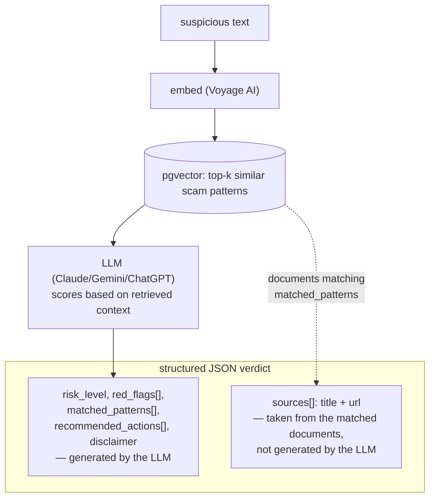
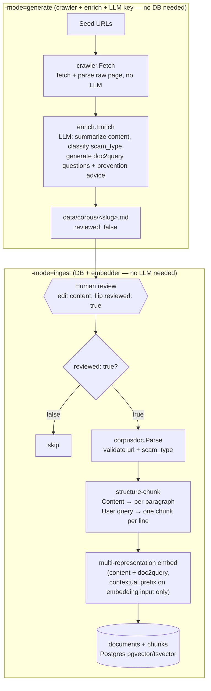

<p align="right">
  <a href="README-en.md"> English</a>
  &nbsp;|&nbsp;
  <a href="README.md"> Tiếng Việt</a>
</p>

# ChậmLại.vn 🛡️

**AI assistant that helps Vietnamese users — especially the elderly — check whether a suspicious message is a scam.**

Paste any suspicious text (SMS, Zalo message, "vacation contract", "easy job, high pay"...) and get a traffic-light risk verdict, plain-language red flags, and what to do next. No login required.

> ⚠️ **Disclaimer**: ChậmLại.vn is a reference tool, not legal advice. It never declares anything "100% safe" and never makes claims about specific individuals or organizations.

- [ChậmLại.vn 🛡️](#chậmlạivn-️)
  - [I. How it works](#i-how-it-works)
  - [II. Why RAG?](#ii-why-rag)
  - [III. Tech stack](#iii-tech-stack)
  - [IV. Project layout](#iv-project-layout)
  - [V. Building the corpus](#v-building-the-corpus)
  - [VI. Getting started](#vi-getting-started)
  - [VII. Roadmap](#vii-roadmap)


## I. How it works



RAG over a labeled corpus of Vietnamese scam-warning articles (VTV, CAND, Cục An toàn thông tin...), with scam-signal scoring by Claude.

## II. Why RAG?

**1. RAG keeps up with new scam scenarios; fine-tuning can't.** Scam tactics in Vietnam change constantly. With RAG, adding a single new warning article to the corpus lets the system recognize that pattern immediately — especially powerful when the user community contributes real-world data. Fine-tuning, by contrast, is expensive and requires collecting, cleaning, and labeling data, then retraining every time a new tactic appears.

**2. The data flow runs straight from text to verdict.** Suspicious contract/text → embed → query pgvector for similar scam patterns → inject into the prompt → Claude scores red/yellow/green. This is exactly the Retrieval → Augmentation → Generation pipeline, mapped directly onto the packages under `internal/`.

**3. Combine semantic + lexical (TF-IDF), and focus on the Vietnamese market.** Semantic search (embeddings) catches text that is worded differently but is the same kind of scam; lexical search (Postgres tsvector TF-IDF) catches tactic names, fake hotline numbers, and characteristic phrases. The two complement each other, so we use both rather than semantic alone. We won't try to generalize to other markets yet — each country has its own scam playbook, so we nail Vietnam first.

## III. Tech stack

Go · PostgreSQL + pgvector · Voyage AI embeddings · Claude/Gemini/ChatGPT API

## IV. Project layout

```
cmd/
  api/            # HTTP API entrypoint (+ swagger)
  crawler/        # CLI: two-phase corpus build — see cmd/crawler's package doc (-mode=generate|ingest)
  seed/           # CLI: manual end-to-end smoke test of the RAG retrieval path
  migration/      # DB migration runner
internal/
  ai/
    embedder/     # embedding providers behind a Service interface (Voyage, Azure...)
    reranker/     # reranking providers behind a Service interface (optional stage after RRF)
    llm/          # Anthropic/Gemini/OpenAI clients behind a Service interface + prompt templates
  scam/           # the RAG domain, one package per pipeline stage
    ingest/       # corpusdoc.Document → structure-chunk + multi-representation embed → store
    retriever/    # query text → pgvector top-k + hybrid (BM25/RRF), doc-level dedupe, optional rerank
    analyzer/     # core use case: text → retrieve → LLM scoring → verdict
    crawler/      # fetch + parse raw pages (LLM-free); rule-based scam labelling; SSRF-hardened HTTP client
    enrich/       # raw crawled text → LLM tool call → corpusdoc.Document (generate-mode's LLM step)
  infra/
    store/        # PostgreSQL + pgvector data-access (single pgxpool.Pool)
    repository/   # relational/auth repositories
  api/            # HTTP layer: base, context (root, v1, v2 scaffolded)
  model/          # domain types (Document, Chunk — plain pgx-native structs, no gorm)
pkg/util/
  corpusdoc/      # canonical 4-section corpus markdown: parse/serialize/slug — the crawl→ingest interchange type
  eval/           # retrieval-quality metrics (Hit@K, MRR), dependency-free
  rag/            # document parsing + size-based chunker (used as ingest's sub-splitter for long sections)
  ulid/           # ULID generation
config/           # config loading
migrations/       # SQL schema, applied via cmd/migration
data/
  corpus/         # generated/reviewed corpus markdown (git-ignored except .gitkeep + example.md)
benchmark/        # retrieval benchmark design doc (README.md) — not yet run, see its own status section
```

## V. Building the corpus

The corpus (scam-warning documents) is built in two separate stages, connected by the canonical
4-section markdown format (`pkg/util/corpusdoc`) and a mandatory human-review step — see the
`cmd/crawler` package doc for full details.



- **`-mode=generate`** only needs `crawler` + `enrich` + an LLM API key (no DB/embedder): fetches
  the raw page, calls the LLM to summarize/classify/generate victim-voice doc2query questions +
  prevention advice, then writes `data/corpus/<slug>.md` marked `reviewed: false`.
- A human reviews/edits the file and flips `reviewed: false` → `true` — the only technical gate
  between the LLM's output and the stored corpus, not just a convention.
- **`-mode=ingest`** only needs a database + embedder (no LLM/crawler): refuses any file still
  marked `reviewed: false`, parses + validates it, chunks by structure (Content split by
  paragraph, each User query line becomes its own doc2query vector), embeds multi-representation,
  and stores atomically into `documents`/`chunks`.

Both commands are idempotent re-runs: `generate` skips a URL that already has a file; `ingest`
skips a URL already in the corpus (checked before spending on embeddings).

## VI. Getting started

```bash
make switch.local        # copy .env.local -> .env, then fill in API keys
docker compose up -d db  # Postgres + pgvector via Docker (:5432)
make migrate.local       # apply migrations
go run ./cmd/api         # API on :8080
curl localhost:8080/health
```

## VII. Roadmap

- [x] Repo skeleton, Postgres + pgvector setup
- [x] Corpus: 50+ labeled scam-warning articles indexed (currently ~50 articles, 101 chunks)
- [x] Retrieval stack: hybrid (vector + BM25 via RRF) + reranking (Voyage rerank-2.5) built,
      exercised via `cmd/seed`
- [ ] Wire the retrieval stack into `/analyze` (it's still vector-only today — waiting on
      benchmark evidence at a larger corpus size, see `benchmark/README.md`)
- [ ] Eval baseline (precision/recall on golden dataset) — foundation already in
      `benchmark/README.md`, waiting on the corpus to hit its activation threshold
- [ ] Web UI: paste box → traffic light, large text, mobile-friendly
- [ ] Streaming, prompt caching, contextual retrieval
- [ ] Public deploy
