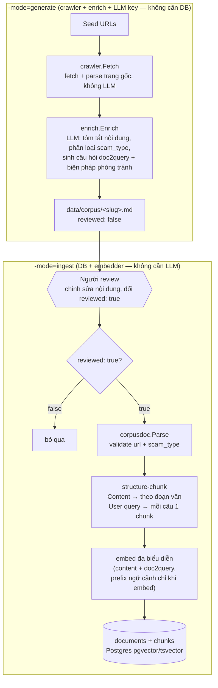

<p align="right">
  <a href="README-en.md"> English</a>
  &nbsp;|&nbsp;
  <a href="README.md"> Tiếng Việt</a>
</p>

# ChậmLại.vn 🛡️

**Trợ lý AI giúp người Việt — đặc biệt là người lớn tuổi — kiểm tra một tin nhắn đáng ngờ có phải lừa đảo hay không.**

Dán bất kỳ văn bản đáng ngờ nào (SMS, tin nhắn Zalo, "hợp đồng kỳ nghỉ", việc nhẹ lương cao...) và nhận về đánh giá tiềm tàng, các dấu hiệu đáng ngờ bằng ngôn ngữ đời thường, và việc nên làm tiếp theo. Không cần đăng nhập.

> ⚠️ **Lưu ý**: ChậmLại.vn là công cụ tham khảo, không thay thế tư vấn pháp lý. Công cụ không bao giờ khẳng định "an toàn 100%" và không kết luận về cá nhân hay tổ chức cụ thể.

- [ChậmLại.vn 🛡️](#chậmlạivn-️)
  - [I. Cách hoạt động](#i-cách-hoạt-động)
  - [II. Vì sao chọn RAG?](#ii-vì-sao-chọn-rag)
  - [III. Công nghệ](#iii-công-nghệ)
  - [IV. Cấu trúc dự án](#iv-cấu-trúc-dự-án)
  - [V. Xây dựng corpus dữ liệu](#v-xây-dựng-corpus-dữ-liệu)
  - [VI. Chạy thử](#vi-chạy-thử)
  - [VII. Lộ trình](#vii-lộ-trình)

## I. Cách hoạt động

```
văn bản đáng ngờ
      │
      ▼
 embed (Voyage AI) ──► pgvector: top-k scam pattern tương tự
      │                          │
      ▼                          ▼
 LLM (Claude/Gemini/ChatGPT) ◄── context đã retrieve
      │
      ▼
 kết quả JSON có cấu trúc
 { risk: đỏ|vàng|xanh, red_flags[], next_actions[], patterns[] }
```

RAG trên corpus bài cảnh báo lừa đảo đã gắn nhãn (VTV, CAND, Cục An toàn thông tin...), chấm điểm dấu hiệu lừa đảo bằng Claude.

## II. Vì sao chọn RAG?

**1. RAG bắt kịp kịch bản lừa đảo mới, fine-tune thì không.** Chiêu lừa ở Việt Nam thay đổi liên tục. Với RAG, chỉ cần thêm một bài cảnh báo mới vào corpus là hệ thống nhận ra pattern đó ngay — đặc biệt mạnh khi cộng đồng người dùng đóng góp dữ liệu thực tế. Fine-tune ngược lại tốn công thu thập, làm sạch, gắn nhãn dữ liệu và chi phí cao hơn nhiều, mà mỗi lần có chiêu mới lại phải train lại.

**2. Luồng dữ liệu đi thẳng từ văn bản tới verdict.** Hợp đồng/văn bản đáng ngờ → embed → query pgvector lấy scam pattern tương tự → inject vào prompt → Claude chấm điểm đỏ/vàng/xanh. Đây chính là ba bước Retrieval → Augmentation → Generation, ánh xạ trực tiếp vào các package trong `internal/`.

**3. Kết hợp semantic + lexical (TF-IDF), và tập trung thị trường Việt Nam.** Tìm theo ý nghĩa (embedding) bắt được văn bản diễn đạt khác nhưng cùng bản chất lừa; tìm theo từ khóa (Postgres tsvector TF-IDF) bắt được tên chiêu trò, số hotline giả, cụm từ đặc trưng. Hai cách bổ trợ nhau nên dùng cả hai thay vì chỉ semantic. Không cố tổng quát hóa cho thị trường khác lúc này — mỗi quốc gia có kịch bản lừa đảo riêng, làm tốt cho Việt Nam trước đã.

## III. Công nghệ

Go · PostgreSQL + pgvector · Voyage AI embeddings · Claude/Gemini/ChatGPT API

## IV. Cấu trúc dự án

```
cmd/
  api/            # entrypoint HTTP API (+ swagger)
  crawler/        # CLI: dựng corpus 2 giai đoạn — xem doc comment của package cmd/crawler (-mode=generate|ingest)
  seed/           # CLI: smoke test end-to-end đường retrieval của RAG
  migration/      # chạy DB migration
internal/
  ai/
    embedder/     # provider embedding sau interface Service (Voyage, Azure...)
    reranker/     # provider reranking sau interface Service (bước tùy chọn sau RRF)
    llm/          # client Anthropic/Gemini/OpenAI sau interface Service + prompt templates
  scam/           # domain RAG, mỗi package một bước pipeline
    ingest/       # corpusdoc.Document → chunk theo cấu trúc + embed đa biểu diễn → store
    retriever/    # văn bản truy vấn → pgvector top-k + hybrid (BM25/RRF), dedupe theo document, rerank tùy chọn
    analyzer/     # use case lõi: văn bản → retrieve → LLM scoring → verdict
    crawler/      # fetch + parse trang gốc (không LLM); gắn nhãn loại scam bằng rule; HTTP client chống SSRF
    enrich/       # nội dung crawl thô → gọi LLM → corpusdoc.Document (bước LLM của generate-mode)
  infra/
    store/        # data-access Postgres + pgvector (một pgxpool.Pool)
    repository/   # repository quan hệ / auth
  api/            # tầng HTTP: middleware stack, lỗi RFC 9457, route root + versioned
    problem/      # RFC 9457 Problem Details (application/problem+json) + adapter dịch lỗi
    bind/         # decode JSON nghiêm ngặt + validator-tag → thông báo tiếng Việt
    respond/      # ghi response JSON thành công
    middleware/   # request ID, log request có cấu trúc (slog), phục hồi panic
    root/         # route không version (GET /health)
    v1/analyze/   # POST /v1/analyze
    swagger/      # sinh bởi `make swagger` — không sửa tay
  model/          # domain types (Document, Chunk — struct thuần pgx, không dùng gorm)
pkg/util/
  corpusdoc/      # định dạng markdown 4 phần chuẩn của corpus: parse/serialize/slug — kiểu trung gian crawl→ingest
  eval/           # metric đo chất lượng retrieval (Hit@K, MRR), không phụ thuộc gì
  rag/            # parse tài liệu + chunker theo kích thước (dùng làm bộ chia nhỏ phụ trong ingest)
  ulid/           # sinh ULID
config/           # nạp cấu hình
migrations/       # schema SQL, áp qua cmd/migration
data/
  corpus/         # tài liệu corpus đã sinh/đã review (git-ignore trừ .gitkeep + example.md)
benchmark/        # thiết kế benchmark retrieval (README.md) — chưa chạy, xem trạng thái trong đó
```

## V. Xây dựng corpus dữ liệu

Corpus (các bài cảnh báo lừa đảo) được xây dựng qua 2 giai đoạn tách biệt, nối nhau bởi định dạng
markdown 4 phần chuẩn (`pkg/util/corpusdoc`) và một bước con người review bắt buộc — chi tiết xem
doc comment của package `cmd/crawler`.



- **`-mode=generate`** chỉ cần `crawler` + `enrich` + API key của LLM (không đụng DB/embedder):
  fetch trang gốc, gọi LLM tóm tắt/phân loại/sinh câu hỏi doc2query (giọng nạn nhân) + biện pháp
  phòng tránh, rồi ghi ra `data/corpus/<slug>.md` với `reviewed: false`.
- Con người review/sửa file, đổi `reviewed: false` → `true` — đây là điểm chặn kỹ thuật duy nhất
  giữa output của LLM và corpus được lưu trữ, không chỉ là quy ước.
- **`-mode=ingest`** chỉ cần DB + embedder (không đụng LLM/crawler): từ chối file còn
  `reviewed: false`, parse + validate, chunk theo cấu trúc (Content theo đoạn văn, mỗi câu trong
  User query thành 1 vector doc2query riêng), embed đa biểu diễn rồi lưu nguyên tử vào
  `documents`/`chunks`.

Cả 2 lệnh đều idempotent khi chạy lại: `generate` bỏ qua URL đã có file; `ingest` bỏ qua URL đã có
trong corpus (kiểm tra trước khi tốn phí embedding).

## VI. Chạy thử

```bash
make switch.local        # copy .env.local -> .env, rồi điền API keys
docker compose up -d db  # Postgres + pgvector qua Docker (:5432)
make migrate.local       # áp các migration
go run ./cmd/api         # API tại :8080
curl localhost:8080/health
curl -X POST localhost:8080/v1/analyze -H 'Content-Type: application/json' \
  -d '{"text":"chuyển khoản gấp 10 triệu để giữ chỗ"}'
# Swagger UI (chỉ APP_ENV=development, mặc định): http://localhost:8080/swagger/
```

**Giới hạn truy cập.** `POST /v1/analyze` chạy chuỗi gọi API trả phí (Voyage
embed + Claude scoring), nên có 2 lớp bảo vệ độc lập:

| Biến môi trường | Mặc định | Ý nghĩa |
|---|---|---|
| `RATE_LIMIT_RPM` | `20` | Số request/phút cho mỗi IP (`<= 0` để tắt). Ngưỡng cố ý rộng tay vì nhà mạng di động Việt Nam (Viettel/Mobifone...) dùng chung IP giữa nhiều thuê bao qua CGNAT — đặt chặt sẽ chặn nhầm cả một cụm người dùng. |
| `LLM_DAILY_BUDGET` | `1000` | Trần **tổng số** request/ngày được chạm tới pipeline trả phí, tính trên toàn hệ thống (không phân biệt IP) — đây là lưới an toàn chính cho chi phí Voyage/Claude. Khi vượt, mọi request nhận `429` tới hết ngày (giờ Việt Nam). |

Đây là giới hạn theo **tần suất**, không phải giới hạn theo **quốc gia** — một
IP ở bất kỳ đâu cũng chịu cùng ngưỡng, không có chặn theo vùng địa lý (geo-
blocking). Nếu cần chặn/giới hạn theo quốc gia sau này, đó là cấu hình riêng ở
tầng Cloudflare (Geo-blocking / IP Access Rules), không phải phần này.

⚠️ **Điều kiện triển khai bắt buộc**: service phải chạy sau Cloudflare (hoặc
CDN tương đương), và origin phải khóa firewall chỉ nhận traffic từ dải IP
Cloudflare (https://www.cloudflare.com/ips/). Rate-limit theo IP tin vào header
`CF-Connecting-IP`, chỉ đáng tin khi firewall đã khóa đúng — thiếu bước này,
`CF-Connecting-IP` có thể bị giả mạo bởi ai gọi thẳng vào origin.

## VII. Lộ trình

- [x] Skeleton repo, setup Postgres + pgvector
- [x] Corpus: index 50+ bài cảnh báo lừa đảo đã gắn nhãn (hiện ~50 bài, 101 chunks)
- [x] Retrieval stack: hybrid (vector + BM25 qua RRF) + reranking (Voyage rerank-2.5) đã build,
      dùng qua `cmd/seed`
- [x] Rate limit theo IP + trần ngân sách gọi LLM/ngày cho `/v1/analyze` (xem "Giới hạn truy cập" ở
      mục VI)
- [ ] Wire retrieval stack vào `/v1/analyze` (hiện `/v1/analyze` vẫn vector-only — chờ benchmark
      chứng minh trên corpus đủ lớn, xem `benchmark/README.md`)
- [ ] Eval baseline (precision/recall trên golden dataset) — foundation đã có ở
      `benchmark/README.md`, chờ corpus đạt ngưỡng kích hoạt
- [ ] Web UI: ô dán văn bản → đèn giao thông, chữ to, mobile-friendly
- [ ] Streaming, prompt caching, contextual retrieval
- [ ] Deploy public
